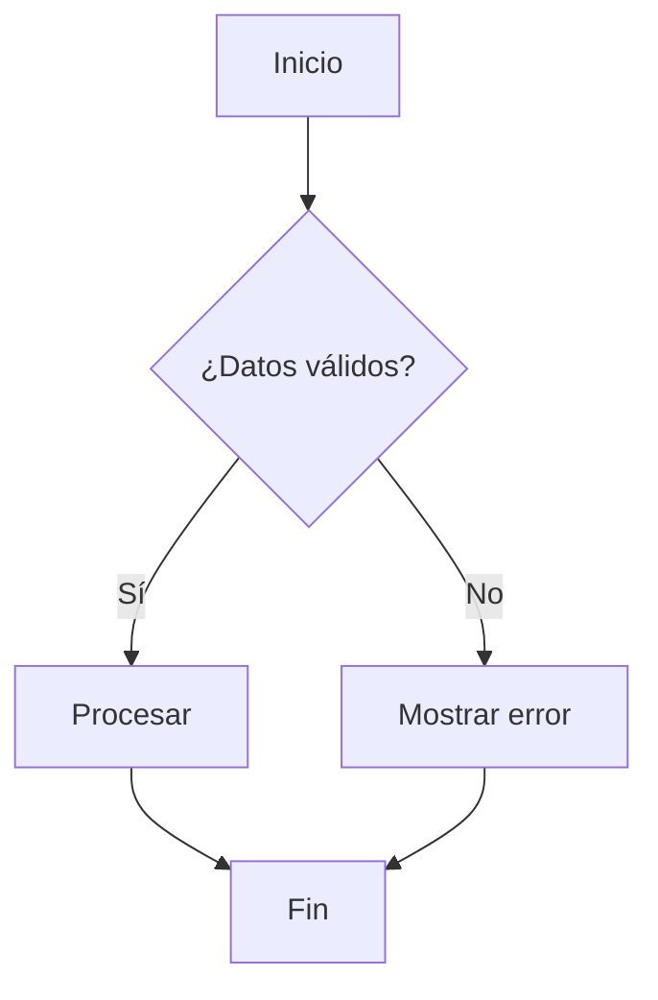
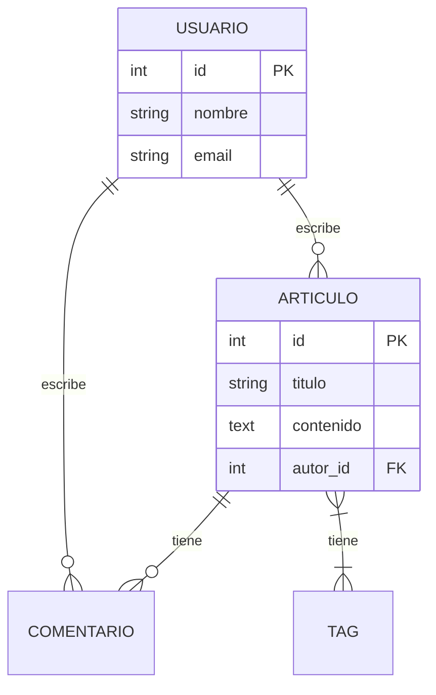

Un diagrama vale más que mil líneas de código. No porque reemplace el código, sino porque **comunica ideas complejas de forma visual**. Cuando necesitas explicar un sistema a un compañero, planificar una funcionalidad o documentar una decisión, un buen diagrama es la herramienta más efectiva.

En esta guía vas a aprender tres tipos de diagramas esenciales: diagramas de flujo para lógica, casos de uso para interacciones y MER (Modelo Entidad-Relación) para bases de datos.

---

## Diagramas de flujo

Un **diagrama de flujo** representa visualmente un proceso o algoritmo. Usa formas estándar conectadas por flechas para mostrar el flujo de decisiones.

### Símbolos básicos

| Forma | Significado | Ejemplo |
|-------|-------------|---------|
| **Óvalo** | Inicio / Fin | "Inicio del proceso" |
| **Rectángulo** | Proceso / Acción | "Validar datos del usuario" |
| **Rombo** | Decisión | "¿Email válido?" |
| **Paralelogramo** | Input / Output | "Leer datos del formulario" |
| **Flecha** | Dirección del flujo | → |

### Ejemplo: proceso de login

```
[Inicio] → [Recibir email y password] → [Validar formato]
    → ¿Formato válido?
        → No → [Retornar error 400] → [Fin]
        → Sí → [Buscar usuario en BD]
            → ¿Existe?
                → No → [Retornar error 401] → [Fin]
                → Sí → [Verificar password con hash]
                    → ¿Correcto?
                        → No → [Retornar error 401] → [Fin]
                        → Sí → [Generar JWT] → [Retornar token 200] → [Fin]
```


*Diagrama de flujo del proceso de login: cada forma tiene un significado específico.*

### Cuándo usar diagramas de flujo

- **Algoritmos complejos:** lógica con múltiples condiciones
- **Procesos de negocio:** flujos de aprobación, onboarding, pagos
- **Debuggear:** visualizar el camino que toma el código
- **Documentar:** explicar un proceso a alguien nuevo en el equipo

### Herramientas

- **Mermaid:** diagramas como código (se renderiza en GitHub, Notion)
- **Draw.io / diagrams.net:** gratuito, online, exporta a PNG/SVG
- **Excalidraw:** estilo dibujado a mano, excelente para brainstorming

---

## Casos de uso

Un **diagrama de casos de uso** muestra las interacciones entre los **actores** (usuarios, sistemas externos) y el **sistema**. Responde a: "¿qué puede hacer cada tipo de usuario?"

### Elementos

- **Actor:** una persona o sistema externo (stick figure)
- **Caso de uso:** una funcionalidad del sistema (óvalo)
- **Línea:** conexión entre actor y caso de uso
- **Frontera del sistema:** rectángulo que delimita lo que es el sistema

### Ejemplo: sistema de biblioteca

```
┌─────────────────────────────────────────┐
│         Sistema de Biblioteca           │
│                                         │
│    (Buscar libro)    (Reservar libro)   │
│         ○                 ○             │
│        / \               / \            │
│       /   \             /   \           │
│      /     \           /     \          │
│  👤 Usuario        👤 Bibliotecario     │
│                    (Agregar libro) ○    │
│                     (Registrar    ○     │
│                      devolución)        │
└─────────────────────────────────────────┘
```

### Descripción de caso de uso

Cada caso de uso se documenta con:

```
Caso de uso: Reservar libro
Actor: Usuario registrado
Precondición: El usuario está autenticado y el libro está disponible

Flujo principal:
1. El usuario busca un libro
2. El sistema muestra disponibilidad
3. El usuario selecciona "Reservar"
4. El sistema confirma la reserva
5. El sistema envía email de confirmación

Flujo alternativo:
4a. El libro no está disponible
    → El sistema ofrece agregar a lista de espera

Postcondición: El libro queda reservado por 48 horas
```

### Cuándo usar casos de uso

- **Definir alcance:** qué hace y qué NO hace el sistema
- **Comunicar con stakeholders:** no técnicos entienden casos de uso
- **Planificar sprints:** cada caso de uso puede ser una historia de usuario
- **Documentar requisitos:** base para tests de aceptación

---

## MER: Modelo Entidad-Relación

El **MER** (Modelo Entidad-Relación) representa la estructura de una base de datos: qué entidades existen, qué atributos tienen y cómo se relacionan.

### Elementos

- **Entidad:** una "cosa" del sistema (tabla en la BD)
- **Atributo:** una propiedad de la entidad (columna)
- **Relación:** cómo se conectan las entidades
- **Cardinalidad:** cuántos de cada lado (1:1, 1:N, M:N)

### Ejemplo: sistema de blog

```
┌──────────────────┐       ┌──────────────────┐
│     USUARIO      │       │    ARTICULO      │
├──────────────────┤       ├──────────────────┤
│ id (PK)          │──1──N│ id (PK)          │
│ nombre           │       │ titulo           │
│ email            │       │ contenido        │
│ password_hash    │       │ creado_en        │
│ creado_en        │       │ autor_id (FK)    │
└──────────────────┘       └──────────────────┘
                                    │
                                    N
                           ┌──────────────────┐
                           │    COMENTARIO    │
                           ├──────────────────┤
                           │ id (PK)          │
                           │ texto            │
                           │ creado_en        │
                           │ articulo_id (FK) │
                           │ usuario_id (FK)  │
                           └──────────────────┘
```

### Cardinalidades

| Notación | Significado | Ejemplo |
|----------|-------------|---------|
| **1:1** | Uno a uno | Un usuario tiene un perfil |
| **1:N** | Uno a muchos | Un usuario tiene muchos artículos |
| **M:N** | Muchos a muchos | Un artículo tiene muchos tags, un tag tiene muchos artículos |

### Relaciones M:N requieren tabla intermedia

```
┌──────────────┐     ┌──────────────────┐     ┌──────────────┐
│  ARTICULO    │     │ ARTICULO_TAG     │     │    TAG       │
├──────────────┤     ├──────────────────┤     ├──────────────┤
│ id (PK)      │──N──│ articulo_id (FK) │  N──│ id (PK)      │
│ titulo       │     │ tag_id (FK)      │─────│ nombre       │
└──────────────┘     └──────────────────┘     └──────────────┘
```

### Cuándo usar MER

- **Diseñar base de datos:** antes de crear tablas, modela las entidades
- **Comunicar estructura:** un MER se entiende más rápido que SQL
- **Identificar problemas:** relaciones faltantes, redundancias
- **Documentar:** referencia para el equipo

---

## Diagramas con Mermaid: código como diagrama

**Mermaid** permite escribir diagramas como texto que se renderiza automáticamente:

````markdown

````

Se renderiza en GitHub, Notion, Obsidian y muchos editores de código.

### Ejemplo MER en Mermaid

````markdown

````


*El mismo MER renderizado con Mermaid: diagramas como código que se versionan con Git.*

---

## Por qué importa

Los diagramas no son decoración — son herramientas de comunicación:

- **Un diagrama de flujo** te ayuda a pensar la lógica antes de escribir código.
- **Un caso de uso** alinea al equipo sobre qué debe hacer el sistema.
- **Un MER** previene errores de diseño de base de datos antes de crear tablas.
- **Mermaid** permite versionar diagramas junto con el código.

No necesitas ser diseñador gráfico. Un diagrama feo pero claro vale más que un diagrama bonito pero confuso.

---

## La IA y los diagramas

### Lo bueno

- **Generar Mermaid:** describe el proceso y la IA genera el código Mermaid.
- **Convertir texto a diagrama:** pega una descripción de un flujo y la IA lo diagrama.
- **Sugerir mejoras:** muéstrale tu diagrama y la IA sugiere qué falta.
- **Generar MER desde descripción:** "necesito una BD para un e-commerce" → la IA genera el MER.

### Lo que no debes hacer

- **No confíes ciegamente en cardinalidades generadas por IA.** Una relación M:N incorrecta causa problemas de datos.
- **No uses diagramas como reemplazo de documentación escrita.** Los diagramas complementan, no reemplazan.
- **No asumas que la IA entiende tu dominio.** Verifica que las entidades y relaciones tengan sentido para tu negocio.

---

## Desafío: diagrama tu proyecto

**Objetivo:** crear los tres tipos de diagramas para un sistema real.

**Tu tarea:**

Diseña los diagramas para un **sistema de reservas de restaurante**:

1. **Diagrama de flujo:** el proceso de hacer una reserva (desde que el usuario elige fecha/hora hasta que recibe confirmación)
2. **Casos de uso:** identifica los actores (cliente, mesero, administrador) y sus interacciones con el sistema
3. **MER:** modela la base de datos con entidades como Mesa, Reserva, Cliente, Horario, etc. Incluye cardinalidades

**Bonus:** escribe los tres diagramas en formato Mermaid y renderízalos en un archivo Markdown.

---

## Para seguir explorando

- **[Mermaid Live Editor](https://mermaid.live/)** — editor online para probar diagramas Mermaid.
- **[Draw.io](https://app.diagrams.net/)** — herramienta gratuita de diagramas.
- **[UML Distilled](https://www.amazon.com/UML-Distilled-Standard-Modeling-Technology/dp/0321193687)** — libro clásico sobre diagramas UML.
- **[Excalidraw](https://excalidraw.com/)** — pizarra virtual estilo dibujado a mano.

---

## Resumen

- **Diagramas de flujo** representan procesos con formas estándar: óvalo (inicio/fin), rectángulo (proceso), rombo (decisión).
- **Casos de uso** muestran interacciones entre actores y el sistema, útiles para definir alcance y comunicar con no técnicos.
- **MER** (Modelo Entidad-Relación) representa la estructura de una base de datos con entidades, atributos y cardinalidades.
- Las **cardinalidades** son: 1:1 (uno a uno), 1:N (uno a muchos), M:N (muchos a muchos, requiere tabla intermedia).
- **Mermaid** permite escribir diagramas como código que se renderiza automáticamente y se versiona con Git.
- Los diagramas son herramientas de **comunicación**, no de decoración. Un diagrama claro vale más que uno bonito.

En la próxima guía vamos a entrar al mundo de las bases de datos: **Introducción a SQL y PostgreSQL** — el lenguaje para consultar datos relacionales.
